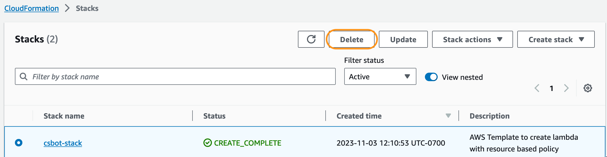

# Build a customer service bot with agents for Amazon Bedrock and apply Guardrails for responsible AI policies

This lab is provided as part of **[AWS Innovate AI/ML and Data Edition](https://aws.amazon.com/events/aws-innovate/apj/aiml-data/)**, it has been adapted from the [blog post](https://aws.amazon.com/blogs/machine-learning/build-a-foundation-model-fm-powered-customer-service-bot-with-agents-for-amazon-bedrock/).

ℹ️ You will run this lab in your own AWS account. Please follow directions at the end of the lab to remove resources to avoid future costs.

ℹ️ Please let us know what you thought of this session and how we can improve the experience for you in the future by completing [the survey](#survey) at the end of the lab.
Participants who complete the surveys from AWS Innovate Online Conference will receive a gift code for USD25 in AWS credits  1, 2 & 3 .

## **Overview**
In this lab, you will learn how to use [agents for Amazon Bedrock](https://aws.amazon.com/bedrock/agents/) to create fully managed agents in a few clicks. You can follow step-by-step guide with building blocks to create a customer service bot. We use a text generation model (Anthropic Claude V2) and agents for Amazon Bedrock for this solution. We provide an AWS CloudFormation template to provision the resources needed for building this solution. 

## **Architecture**
The following diagram depicts a high-level architecture of this solution.

1. You can create an agent with Amazon Bedrock-supported FMs such as Anthropic Claude V2.
2. Attach API schema, residing in an Amazon Simple Storage Service (Amazon S3) bucket, and a Lambda function containing the business logic to the agent. (Note: This is a one-time setup step.)
3. The agent uses customer requests to create a prompt using the ReAct framework. It, then, uses the API schema to invoke corresponding code in the Lambda function.
4. You can perform a variety of tasks, including sending email notifications, writing to databases, and triggering application APIs in the Lambda functions.

## Setup
### Request Access To Model
To implement the solution, you should have an AWS account and access to Amazon Bedrock with agents enabled (currently in preview).
1. Navigate to [Model Access](https://us-east-1.console.aws.amazon.com/bedrock/home?region=us-east-1#/modelaccess) page in **Amazon Bedrock Console**. Select **Manage model access**.
2. Select the checkboxes next to the models you want to add access to. To request access to all models belonging to a provider, select the check box next to the provider. In this lab, we need to have access to models from Anthropic

3. Select **Save changes** to request access. The changes may take several minutes to take place.
4. If your request is successful, the **Access status** changes to **Access granted**

### Deploy Cloud Formation
1. Use AWS CloudFormation template to create the resource stack required for the solution.

|             |                                          |
| :---------- | :--------------------------------------: |
| `us-east-1` |  |

2. Keep clicking **Next** and tick the box **I acknowledge that AWS CloudFormation might create IAM resources with custom names.**. 

3. Click **Submit** to deploy Cloud Formation stack 

4. The CloudFormation template creates two IAM roles. Update these roles to apply least-privilege permissions as discussed in [Security best practices](https://docs.aws.amazon.com/IAM/latest/UserGuide/best-practices.html#grant-least-privilege). Click [here](https://docs.aws.amazon.com/bedrock/latest/userguide/security_iam_service-with-iam-agent.html) to learn what IAM features are available to use with agents for Amazon Bedrock.
- `LambdaBasicExecutionRole` with S3 full access and CloudWatch access for logging.
- `AmazonBedrockExecutionRoleForAgents` with S3 full access and Lambda full access. 
**Important:** Agents for Amazon Bedrock requires the role name to be prefixed by `AmazonBedrockExecutionRoleForAgents_*`

### Bedrock Agents Set Up 

To create an agent, open the [Amazon Bedrock console](https://console.aws.amazon.com/bedrock/home) and choose **Agents** in the left navigation pane. Then select **Create Agent**.

This starts the agent creation workflow.
1.	**Provide agent details:** Give the agent a name and description (optional). Select the service role created by the CloudFormation stack and select **Next**.

2.	**Select a foundation model:** In the **Select model** screen, you select a model. Provide clear and precise instructions to the agent about what tasks to perform and how to interact with the users.

``
You are an agent that helps customers purchase shoes. Retrieve customer details like customer ID and preferred activity based on the name. Then check the inventory for shoes best matching the customer preferred activity. Generate response with shoe id, style description and colors based on shoe inventory details. If multiple matches exist then display all of them to the user with all the details that you see about these items. After a customer indicates, they would like to purchase the shoe, use the shoe ID corresponding to their choice and customer ID retrieved from initial customer details retrieved, to place order for the shoe.
``

3.	**Add action groups:** An action is a task the agent can perform by making API calls. A set of actions comprise an action group. You provide an API schema that defines all the APIs in the action group. You must provide an API schema in the [OpenAPI schema](https://swagger.io/specification/) JSON format. For this agent the API schema is available in the S3 bucket deployed by Cloudformation Template, at **s3://agentb8-x-<your-aws-account-id>/customerservicebot.json.**
The Lambda function contains the business logic needed to perform API calls. You must associate a Lambda function to each action group.

Give the action group a name and a description for the action. Select the Lambda function, provide an API schema file and select **Next**.

4.	Ignore the step "Add Knowledge Base" and click **Next**. In the final step, review the agent configuration and select **Create Agent**.

### Test/Deploy agents for Amazon Bedrock
1.	**Test the agent:** After the agent is created, a dialog box shows the agent overview along with a working draft. The Amazon Bedrock console provides a UI to test your agent.

2.	**Deploy:** After successful testing, you can deploy your agent. To deploy an agent in your application, you must create an alias. Amazon Bedrock then automatically creates a version for that alias.

The following actions occur with the preceding agent setup and the Lambda code provided with this post:

1.	The agent creates a prompt from the developer-provided instructions (such as “You are an agent that helps customers purchase shoes.”), API schemas needed to complete the tasks, and data source details. The automatic prompt creation saves weeks of experimenting with prompts for different FMs. 

2.	The agent orchestrates the user-requested task, such as “I am looking for shoes,” by breaking it into smaller subtasks such as getting customer details, matching the customer-preferred activity with shoe activity, and placing shoe orders. The agent determines the right sequence of tasks and handles error scenarios along the way.

The following screenshot displays some example responses from the agent.

By selecting **Show trace** for each of response, a dialog box shows the reasoning technique used by the agent and the final response generated by the FM.

### Use Guardrails for Amazon Bedrock to promote safe interactions between users and your generative AI applications
[Guardrails for Amazon Bedrock](https://aws.amazon.com/blogs/aws/guardrails-for-amazon-bedrock-helps-implement-safeguards-customized-to-your-use-cases-and-responsible-ai-policies-preview/) is available today in limited preview. Please reach out through your usual AWS Support contacts if you’d like access to Guardrails for Amazon Bedrock.

Using Guardrails for Amazon Bedrock, you can define the following set of policies to create safeguards in your applications.

**Denied topics** – You can define a set of topics that are undesirable in the context of your application using a short natural language description. For example, as a developer at a bank, you might want to set up an assistant for your online banking application to avoid providing investment advice.

**Content filters** – You can configure thresholds to filter harmful content across hate, insults, sexual, and violence categories. While many FMs already provide built-in protections to prevent the generation of undesirable and harmful responses, guardrails give you additional controls to filter such interactions to desired degrees based on your use cases and responsible AI policies. A higher filter strength corresponds to stricter filtering.

## Clean Up
To avoid incurring future charges, delete the resources. You can do this by deleting the stack from the CloudFormation console. 

## Conclusion
Throughout this lab, you have learn how to use [agents for Amazon Bedrock](https://aws.amazon.com/bedrock/agents/) to create fully managed agents in a few clicks. In addition, you also learnt about Guardrails for Amazon Bedrock feature to promote safe interactions between users and your generative AI applications.

As described in the [Machine Learning Lens](https://docs.aws.amazon.com/wellarchitected/latest/machine-learning-lens/machine-learning-lens.html) of the [AWS Well-Architected Framework](https://docs.aws.amazon.com/wellarchitected/latest/framework/welcome.html), personal data should be protected. 

Visit the [Machine Learning Lens](https://docs.aws.amazon.com/wellarchitected/latest/machine-learning-lens/machine-learning-lens.html) and below related Best Practices for more information:
- [MLSEC-02: Design data encryption and obfuscation](https://docs.aws.amazon.com/wellarchitected/latest/machine-learning-lens/mlsec-02.html)
- [MLSEC-05: Protect sensitive data privacy](https://docs.aws.amazon.com/wellarchitected/latest/machine-learning-lens/mlsec-05.html)

## **Survey**
Let us know what you thought of this session and how we can improve the presentation experience for you in the future by completing [this event session poll](https://amazonmr.au1.qualtrics.com/jfe/form/SV_bmgERAD8tX0Eb6m?Session=HAN3). 
Participants who complete the surveys from AWS Innovate Online Conference will receive a gift code for USD25 in AWS credits  1, 2 & 3 . AWS credits will be sent via email by **March 29, 2024**.
Note: Only registrants of AWS Innovate Online Conference who complete the surveys will receive a gift code for USD25 in AWS credits via email.

1AWS Promotional Credits Terms and conditions apply: https://aws.amazon.com/awscredits/

2Limited to 1 x USD25 AWS credits per participant.

3Participants will be required to provide their business email addresses to receive the gift code for AWS credits.
